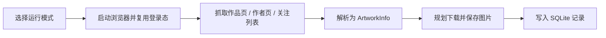

# pixiv-crawl

<p align="center">一个基于 Playwright 的 Pixiv 网站批量抓取工具，支持登录态复用、批量作品抓取、作者增量更新、失败重试和 SQLite 记录。</p>

<p align="center">
  
  
  
  
  
  
</p>

<p align="center">
  | <a href="#-快速开始">快速开始</a> ·
  <a href="#-运行模式">运行模式</a> ·
  <a href="#-核心能力">核心能力</a> ·
  <a href="#-项目结构">项目结构</a> ·
  <a href="#-测试">测试</a> |
</p>

## ✨ 项目介绍

本项目是一个「可持续运行」的 Pixiv 网站图片下载工具，而不只是一次性的抓图脚本。

适合用来做以下事情：

- 批量抓取作品 ID 或作品链接
- 按作者抓取全部作品，或只增量更新新作品
- 按关注列表批量更新画师作品
- 对失败任务做重试、导出和归档
- 保留本地历史记录，避免重复下载

目前未实现的方向：

- 官方 API 大规模数据采集
- 分布式爬虫或高并发抓取平台
- 绕过 Pixiv 登录限制的非浏览器方案（感觉不太能做到）

## 🚀 快速开始

### 1. 准备环境

```powershell
python -m venv .venv
.venv\Scripts\Activate.ps1
python -m pip install --upgrade pip
pip install -r requirements.txt
playwright install chromium
```

### 2. 准备配置

把 [`.env.example`](./.env.example) 复制为 `.env`，至少填写：

```env
# Pixiv 账号
PIXIV_USERNAME=
# Pixiv 密码
PIXIV_PASSWORD=
HEADLESS=false
```
> 注意！不要泄露个人账号！

如果你的网络环境需要代理，再补：

```env
PROXY_SERVER=http://127.0.0.1:7890
PROXY_USERNAME=
PROXY_PASSWORD=
```

日常使用建议保持：

```env
SAVE_DEBUG_ARTIFACTS=false
VERBOSE_DEBUG_OUTPUT=false
```

需要排查页面解析或下载异常时，再临时打开这两个开关。

下载相关配置默认如下：

```env
DOWNLOAD_TIMEOUT_SECONDS=60
DOWNLOAD_RETRY_ATTEMPTS=3
DOWNLOAD_RETRY_BACKOFF_SECONDS=1
```

含义分别是：

- 单次图片请求最多等待 60 秒
- 单页图片默认最多尝试 3 次
- 重试退避按 `1s -> 2s -> 4s` 指数递增

如果服务端返回 `429` 且带有 `Retry-After`，下载器会优先遵守服务端给出的等待时间。

### 3. 启动项目

```powershell
python main.py
```

首次运行建议使用 `HEADLESS=false`，这样遇到 `reCAPTCHA` 时可以手动补验证并保存登录态。  
目前在找方法看看怎么能才能绕过`reCAPTCHA`

## 📦 运行模式

| 模式 | 说明 |
| --- | --- |
| `1` | 批量抓取作品 |
| `2` | 查看历史记录 |
| `3` | 重试失败任务 |
| `4` | 导出失败清单 |
| `5` | 归档并清理旧记录 |
| `6` | 按作者批量抓取作品 |
| `7` | 按关注列表更新画师 |

除了菜单模式，也支持直接走非交互参数模式，适合 Docker、计划任务或脚本调用：

```powershell
python main.py crawl 142463788 https://www.pixiv.net/artworks/142543623
python main.py crawl-author https://www.pixiv.net/users/123456 --update-mode incremental --completed-streak-limit 10
python main.py crawl-following --limit 20 --completed-streak-limit 10
python main.py retry-failed --error-type timeout --limit 50
python main.py history --status failed --error-type timeout --limit 20
python main.py export-failed --error-type download --format json
python main.py archive-records --status completed --days 30 --limit 100 --format json --yes
```

## 🧩 核心能力

### 抓取能力

- 自动登录与登录态复用
- 单作品抓取与解析
- 多图作品自动全下
- 批量输入作品 ID / 作品链接
- 按作者批量抓取作品
- 按作者增量更新作品
- 按关注列表批量更新画师作品

### 稳定性增强

- 登录失败明确退出，不再继续误跑后续流程
- 已完成记录会校验本地文件，缺失时自动重跑
- 失败重试不会清空已有标题、作者、下载文件等历史元数据
- 解析器优先识别当前页真实作品 ID，避免被相关推荐作品串号
- 下载器支持流式写盘，降低大图下载的内存占用
- 下载器会对 `429 / 5xx / timeout / 连接抖动` 做有限重试，并优先遵守 `Retry-After`
- 页面抓取、作者抓取、下载兜底路径带分层诊断日志

### 任务管理

- SQLite 记录成功 / 失败 / 错误类型 / 下载文件
- 查看历史记录
- 按失败类型筛选和重试
- 导出失败清单
- 归档旧记录

## 🔄 工作流



## 🗂 项目结构

更完整的目录说明见 [项目结构.md](./项目结构.md) 和 [项目结构-代码编写.md](./项目结构-代码编写.md)(目前还未完善)。

当前最重要的模块如下：

- `app/browser`：浏览器启动、登录、登录态管理
- `app/crawler`：作品页、作者页、关注列表采集
- `app/parser`：作品信息解析与页面快照提取
- `app/downloader`：下载规划、路径构建、图片下载
- `app/db`：SQLite 任务记录
- `app/services`：CLI、终端展示、批量任务、失败分类、导出
- `app/core`：配置与日志初始化

## 🧪 测试

当前已经覆盖主流程、登录、解析器、下载器、下载规划、路径规则、数据库、CLI、终端展示、作者抓取等核心链路。

```powershell
python -m unittest tests.test_task_service tests.test_author_crawler tests.test_cli_service tests.test_record_exporter tests.test_failure_exporter tests.test_failure_classifier tests.test_db tests.test_main tests.test_parser tests.test_downloader tests.test_console_service tests.test_login tests.test_artwork_crawler tests.test_download_path_builder tests.test_download_planner -v
```

## 🐳 Docker 运行

项目已经提供：

- [Dockerfile](./Dockerfile)
- [docker-compose.yml](./docker-compose.yml)
- [.dockerignore](./.dockerignore)

推荐使用方式：

1. 先在主机完成一次登录，生成 `data/state/storage_state.json`
2. 确认 `.env` 已准备好
3. 构建镜像
4. 启动容器

```powershell
docker compose build
docker compose run --rm pixiv-crawl
```

容器会直接挂载本地的 `data/` 和 `logs/`，所以数据库、图片和登录态都能保留在宿主机。

## 📝 调试与日志

默认情况下，项目会输出相对克制的终端日志。

如果你要排查问题，建议同时打开：

- `VERBOSE_DEBUG_OUTPUT=true`
- `SAVE_DEBUG_ARTIFACTS=true`

日志文件默认会写到 `logs/app.log`，并按大小自动滚动：

- `LOG_MAX_BYTES=5242880`
- `LOG_BACKUP_COUNT=5`

下载层默认还支持有限重试：

- `DOWNLOAD_TIMEOUT_SECONDS=60`
- `DOWNLOAD_RETRY_ATTEMPTS=3`
- `DOWNLOAD_RETRY_BACKOFF_SECONDS=1`

调试信息主要看两处：

- 终端里的 `DEBUG` 日志
- `data/temp/html` 和 `data/temp/json` 下的快照文件

## 📁 运行产物说明

这些目录和文件默认都属于本地产物，不建议提交到仓库：

- `data/images`
- `data/state`
- `data/exports`
- `data/temp`
- `data/*.db`
- `logs`

## 📚 参考资料

- [Playwright 官方 Docker 文档](https://playwright.dev/python/docs/docker)
- [Playwright 官方登录态复用文档](https://playwright.dev/python/docs/auth)
