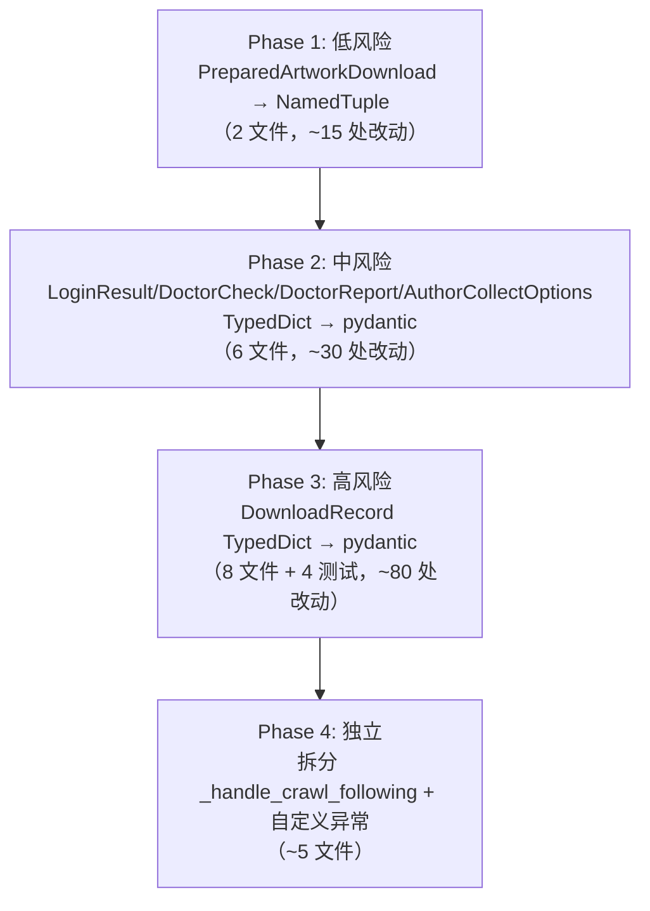

# 架构改进计划 v2

## 概览

5 个改进方向，按依赖关系和影响范围分 4 个阶段执行。



---

## Phase 1: PreparedArtworkDownload → NamedTuple

**影响范围**：

| 文件 | 改动 |
|------|------|
| [`app/downloader/download_planner.py`](app/downloader/download_planner.py:8) | `tuple[ArtworkInfo, list[tuple[int, str]]]` → `NamedTuple('PreparedArtworkDownload', [('artwork', ArtworkInfo), ('plan', list[tuple[int, str]])])` |
| [`app/downloader/image_downloader.py`](app/downloader/image_downloader.py:438) | ~8 处 `prepared[0]` → `prepared.artwork` / `prepared[1]` → `prepared.plan` |
| [`tests/test_task_service.py`](tests/test_task_service.py:42) | `{"artwork": info, "download_plan": [...]}` → `PreparedArtworkDownload(info, [...])` |
| [`tests/test_download_planner.py`](tests/test_download_planner.py) | 同上模式 |

**风险**：极低，纯重命名

---

## Phase 2: 小范围 TypedDict → pydantic

### 2a. `LoginResult` (app/browser/login.py)

| 文件 | 改动 |
|------|------|
| [`app/browser/login.py`](app/browser/login.py:26) | TypedDict → BaseModel |
| [`app/browser/login.py`](app/browser/login.py:97) | `_build_result` 返回 `LoginResult(...)` |
| [`tests/test_login.py`](tests/test_login.py) | ~6 处 `result["success"]` → `result.success` |

### 2b. `AuthorCollectOptions` (app/services/cli_service.py)

| 文件 | 改动 |
|------|------|
| [`app/services/cli_service.py`](app/services/cli_service.py:25) | TypedDict → BaseModel |
| [`app/services/cli_service.py`](app/services/cli_service.py:195) | `return {...}` → `return AuthorCollectOptions(...)` |
| [`app/application.py`](app/application.py:314) | `author_request["user_id"]` → `author_request.user_id` (4 处) |
| [`tests/test_application.py`](tests/test_application.py:103) | `cast(AuthorCollectOptions, {...})` → `AuthorCollectOptions(...)` |

### 2c. `DoctorCheck` / `DoctorReport` (app/services/doctor_service.py)

| 文件 | 改动 |
|------|------|
| [`app/services/doctor_service.py`](app/services/doctor_service.py:28) | 2 个 TypedDict → BaseModel |
| [`app/services/doctor_service.py`](app/services/doctor_service.py:38) | `_build_check` 返回 `DoctorCheck(...)` |
| [`app/services/console_service.py`](app/services/console_service.py:188) | `check['status']` → `check.status` / `check['name']` → `check.name` / `check['detail']` → `check.detail` |
| [`app/application.py`](app/application.py:136) | `report["checks"]` → `report.checks` |
| [`tests/test_doctor_service.py`](tests/test_doctor_service.py) | ~5 处 dict 字面量 → 构造函数 |

**风险**：低，内部模块，改动隔离

---

## Phase 3: DownloadRecord TypedDict → pydantic（高风险）

代码库中引用最广泛的 TypedDict。

**引用分布**：

```
app/db/download_record_repository.py    # 定义 + 15 处构造/访问
app/services/task_service.py            # 5 处 record["xxx"] 访问
app/services/cli_service.py             # 2 处 record["artwork_id"]
app/services/console_service.py         # 3 处 record.get("artwork_id")
app/services/record_exporter.py         # 4 处 record.get("artwork_id")
app/services/failure_exporter.py        # 2 处 record["artwork_id"]
app/services/doctor_service.py          # 0（不引用 DownloadRecord）

tests/test_db.py                        # ~12 处
tests/test_task_service.py              # ~8 处
tests/test_cli_service.py               # ~6 处
tests/test_record_exporter.py           # ~4 处
tests/test_failure_exporter.py          # ~2 处
```

**关键挑战**：`DownloadRecordRepository.get_record()` 返回 `DownloadRecord | None`，SQLite 返回的是 `sqlite3.Row` 对象，需要 `dict(row)` 转换后传入 pydantic。

**策略**：在 `DownloadRecordRepository` 内部将 `sqlite3.Row` 转换为 `DownloadRecord` 对象，对外接口保持不变。

**改动清单**：

| 文件 | 行数 | 改动 |
|------|------|------|
| `app/db/download_record_repository.py` | ~20 | 定义改 BaseModel + 构造调用 |
| `app/services/task_service.py` | ~8 | `record["status"]` → `record.status` |
| `app/services/cli_service.py` | ~4 | `record["artwork_id"]` → `record.artwork_id` |
| `app/services/console_service.py` | ~4 | `record.get("artwork_id")` → `record.artwork_id` |
| `app/services/record_exporter.py` | ~4 | 同上 |
| `app/services/failure_exporter.py` | ~2 | 同上 |
| `tests/test_db.py` | ~12 | 断言从 dict → 属性 |
| `tests/test_task_service.py` | ~8 | 同上 |
| `tests/test_cli_service.py` | ~6 | 同上 |
| `tests/test_record_exporter.py` | ~4 | dict → DownloadRecord 构造 |
| `tests/test_failure_exporter.py` | ~2 | 同上 |

**风险**：中等，需确保 `sqlite3.Row` → `dict` → `DownloadRecord` 链路正确

---

## Phase 4: 代码组织 — 拆分 + 异常

### 4a. 拆分 [`_handle_crawl_following`](app/application.py:341)（77 行 → ~20 行）

将关注画师遍历体提取为独立服务 `app/services/following_service.py`：

```python
# app/services/following_service.py (新增)
def process_following_authors(
    followed_user_ids: list[str],
    author_crawler, crawler, downloader, record_repository,
    runtime_args, interactive_mode,
) -> FollowingUpdateResult:
    """遍历关注画师，批量处理每个画师的作品。"""
    ...
```

[`PixivApplication._handle_crawl_following`](app/application.py:341) 从 ~77 行缩减为 ~20 行：

```python
def _handle_crawl_following(self, ...):
    assert self.author_crawler is not None
    followed_user_ids = self.author_crawler.collect_following_user_ids(...)
    process_following_authors(
        followed_user_ids,
        self.author_crawler, self.crawler, self.downloader,
        self.record_repository, runtime_args, interactive_mode,
    )
```

| 文件 | 改动 |
|------|------|
| `app/services/following_service.py` | **新增** ~100 行 |
| `app/application.py` | ~77 行 → ~20 行 |
| `tests/test_application.py` | `_handle_crawl_following` 测试可减少 mock 量 |
| `tests/test_following_service.py` | **新增** ~3 个测试 |

### 4b. 自定义异常类（与 4a 不冲突）

```python
# app/exceptions.py (新增)
class PixivCrawlError(Exception): ...
class DownloadError(PixivCrawlError): ...
class RateLimitError(PixivCrawlError): ...
class LoginError(PixivCrawlError): ...
class ParseError(PixivCrawlError): ...
class BrowserError(PixivCrawlError): ...
```

[`failure_classifier.py`](app/services/failure_classifier.py) 从字符串匹配迁移为 `isinstance` 检查，[`task_service.py`](app/services/task_service.py) 中使用分类后的异常类型直接设置 `error_type`。

| 文件 | 改动 |
|------|------|
| `app/exceptions.py` | **新增** ~15 行 |
| `app/services/failure_classifier.py` | 字符串匹配 → isinstance（~10 行改动） |
| `app/downloader/image_downloader.py` | 部分 `RuntimeError` → `DownloadError` |
| `tests/test_failure_classifier.py` | 新增 `isinstance` 类型测试 |

---

## 执行顺序与依赖

```
Phase 1 (NamedTuple)     ← 无依赖，先做
    ↓
Phase 2 (小 TypedDict)   ← 无依赖，独立
    ↓
Phase 3 (DownloadRecord) ← 依赖 Phase 2 建立的模式
    ↓
Phase 4a (拆分)          ← 独立，可与 4b 并行
Phase 4b (异常类)        ← 独立
```

**预计改动总量**：~20 文件，~200 处代码改动，测试从 187 预计增至 ~195。

## 风险缓解

- 每阶段完成后运行 `python -m unittest discover tests -v` 确认 187+ 全部通过
- 每阶段独立提交（`git commit` + `git push`）
- 留 `# pyright: ignore[reportArgumentType]` 处理 mock-object 类型警告

---

## 后续

完成以上 4 阶段后，项目代码质量将进一步提升：
- ✅ 零裸 tuple 类型
- ✅ 零 TypedDict（全部 pydantic BaseModel）
- ✅ `PixivApplication` 从 456 行缩减到 ~400 行
- ✅ 结构化异常体系
