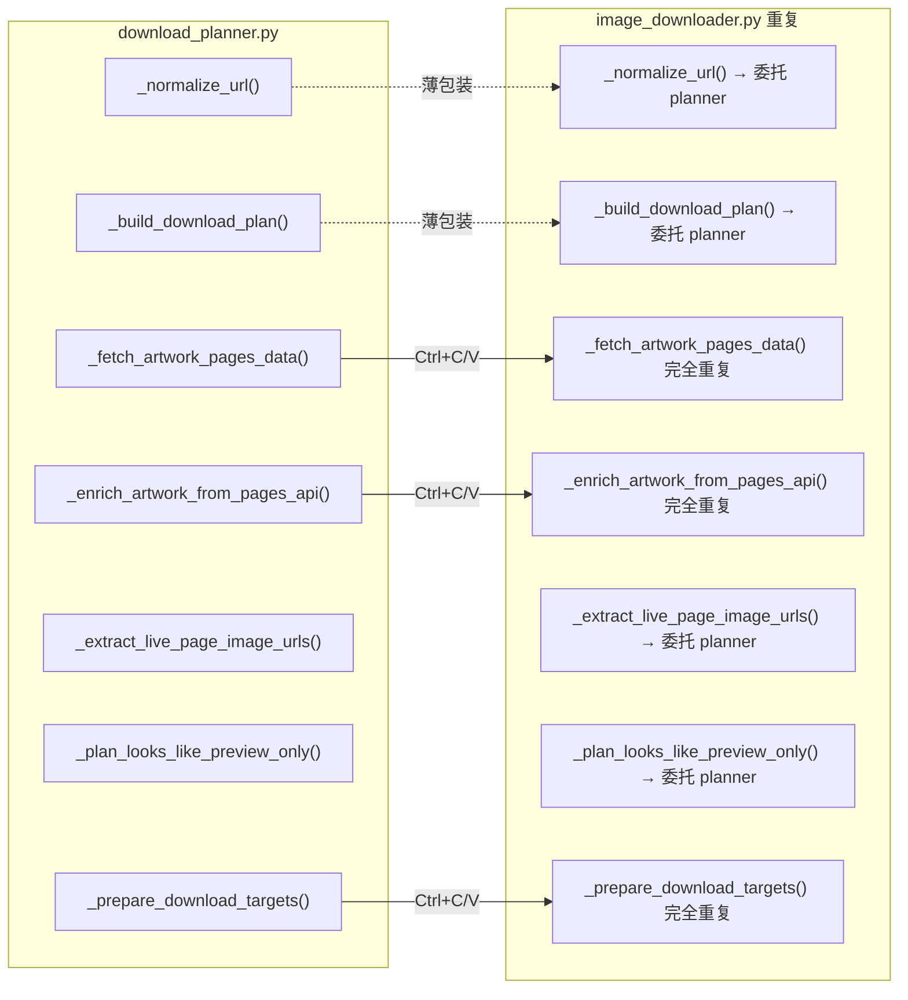
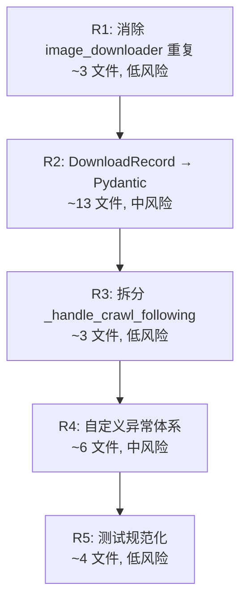

# 架构改进计划 v3

> 基于 v2 的实施进度更新，加上新增发现的代码质量问题。

## v2 完成进度

| Phase | 内容 | 状态 |
|-------|------|------|
| Phase 1 | `PreparedArtworkDownload` → `NamedTuple` | ✅ 已完成 |
| Phase 2a | `LoginResult` → Pydantic `BaseModel` | ✅ 已完成 |
| Phase 2b | `AuthorCollectOptions` → Pydantic `BaseModel` | ✅ 已完成 |
| Phase 2c | `DoctorCheck` / `DoctorReport` → Pydantic `BaseModel` | ✅ 已完成 |
| Phase 3 | `DownloadRecord` TypedDict → Pydantic | ❌ 未开始 |
| Phase 4a | 拆分 `_handle_crawl_following` | ❌ 未开始 |
| Phase 4b | 自定义异常类 | ❌ 未开始 |
| **R1** | 消除 `image_downloader.py` 重复代码 | ✅ 已完成 |

---

## 新增发现：代码重复 — ImageDownloader 与 DownloadPlanner

[`image_downloader.py`](app/downloader/image_downloader.py:295-339) 中存在与 [`download_planner.py`](app/downloader/download_planner.py:27-279) **完全重复的逻辑**：



**根因**：[`image_downloader.py`](app/downloader/image_downloader.py:295-403) 中 `_enrich_artwork_from_pages_api`（38行）、`_prepare_download_targets`（18行）、`_fetch_artwork_pages_data`（42行）与 [`download_planner.py`](app/downloader/download_planner.py:106-279) 完全重复。这些方法最初是"过渡期"的薄包装，但部分方法没有委托给 `self.planner`，而是复制了整套实现。

**影响**：Bug fix 需要改两个地方；新增功能容易只改一处而遗漏另一处。

---

## 更新后的执行计划

### R1: 消除 ImageDownloader 中的重复代码

| # | 文件 | 改动 |
|---|------|------|
| 1 | [`image_downloader.py`](app/downloader/image_downloader.py:295-339) | 删除 `_enrich_artwork_from_pages_api`、`_fetch_artwork_pages_data`，改为直接调用 `self.planner.xxx` |
| 2 | [`image_downloader.py`](app/downloader/image_downloader.py:385-403) | `_prepare_download_targets` 改为调用 `self.planner.prepare_download_targets()` |

**风险**：低。逻辑完全等价，只是消除重复。

### R2: DownloadRecord TypedDict → Pydantic BaseModel（原 Phase 3）

这是剩余的最后一个 TypedDict，引用最广：

| 服务层引用（7 处） | 访问方式 |
|---|---|
| [`task_service.py`](app/services/task_service.py) | `record["status"]`、`record["title"]`、`record.get("downloaded_files")` |
| [`cli_service.py`](app/services/cli_service.py) | `record["artwork_id"]` |
| [`console_service.py`](app/services/console_service.py) | `record.get("artwork_id")` |
| [`record_exporter.py`](app/services/record_exporter.py) | `record.get("artwork_id")` |
| [`failure_exporter.py`](app/services/failure_exporter.py) | `record["artwork_id"]` |

| 测试引用（6 个测试文件） | 访问方式 |
|---|---|
| `test_db.py` | 字典断言 `record["status"]` |
| `test_task_service.py` | 字典断言 + 构造 |
| `test_cli_service.py` | 字典断言 |
| `test_record_exporter.py` | dict → 传入 |
| `test_failure_exporter.py` | dict → 传入 |

**策略**：
1. 在 [`download_record_repository.py`](app/db/download_record_repository.py) 中将 `DownloadRecord` 从 TypedDict 改为 BaseModel
2. `get_record()` 返回 `DownloadRecord` 对象（内部 `sqlite3.Row` → `dict` → `DownloadRecord`）
3. 服务层所有 `record["key"]` → `record.key`
4. 测试层同步更新

**风险**：中等。涉及 ~13 个文件、~50 处改动。但模式已在前几轮 Pydantic 迁移中充分验证。

### R3: 拆分 `_handle_crawl_following`（原 Phase 4a）

[`application.py`](app/application.py:341) 的 `_handle_crawl_following` 有 77 行，内含遍历循环、错误处理、汇总逻辑。提取为独立服务后：
- `PixivApplication` 缩减 ~70 行
- 新模块 `app/services/following_service.py` 可独立测试
- 关注列表逻辑与主调度器解耦

### R4: 自定义异常体系（原 Phase 4b）

当前 [`failure_classifier.py`](app/services/failure_classifier.py) 使用字符串匹配分类失败，存在以下问题：
- 中/英文关键词混杂，脆弱
- 异常携带的类型信息被 `str(exc)` 丢弃
- 新增失败场景需要同时改动分类器和抛出点

建议引入异常层次：

```python
# app/exceptions.py (新增)
class PixivCrawlError(Exception): ...
class DownloadError(PixivCrawlError): ...
class RateLimitError(PixivCrawlError): ...
class LoginError(PixivCrawlError): ...
class ParseError(PixivCrawlError): ...
class BrowserError(PixivCrawlError): ...
class NetworkError(PixivCrawlError): ...
```

`failure_classifier` 使用 `isinstance` 替代字符串匹配，错误类型作为异常属性而非事后推断。

### R5: 测试代码质量 — 类型标注与 mock 规范化

发现的问题：
- [`tests/test_application.py`](tests/test_application.py:50) 大量 `cast(Any, MagicMock())` 绕过类型检查
- [`tests/test_main.py`](tests/test_main.py:17) mock `login_and_save_state` 返回 dict 而非 `LoginResult`（刚刚修过一类）
- [`tests/test_task_service.py`](tests/test_task_service.py:382) 用临时 `FakeArtworkInfo` 类模拟 Pydantic 模型，脆弱且重复

---

## 推荐执行顺序



**预计改动总量**：~25 文件，~120 处代码改动。

---

## 对比 v2 的变化

| 维度 | v2 | v3 |
|------|----|----|
| Phase 1-2 | 5 个类型迁移 | ✅ 全部完成 |
| Phase 3 | DownloadRecord 迁移 | 保留，重新编号 R2 |
| Phase 4a/4b | 拆分 + 异常 | 保留，重新编号 R3/R4 |
| 新增 R1 | — | 消除 image_downloader 重复代码 |
| 新增 R5 | — | 测试规范化 |
| 目标文件 | ~20 文件 | ~25 文件 |
